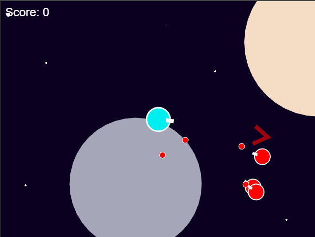

##Blaster

A simple Phaser.js game

To build, ensure that you have node and webpack installed.

Then, either run the webpack-dev-server with

>webpack-dev-server

or build it using webpack

>webpack --progress --colors

and then transfer the files from the build folder to the assets folder.  Then start the express server by

> node server.js

Both methods will make the game available to you at [localhost:8080](localhost:8080)